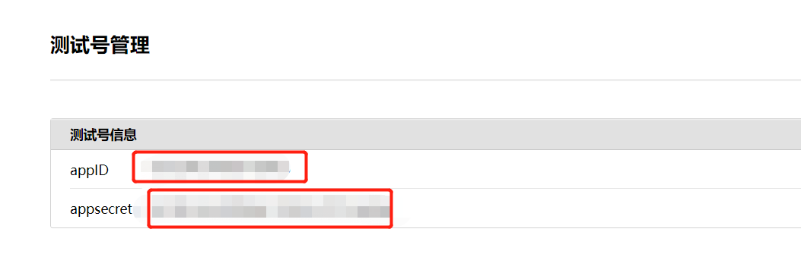
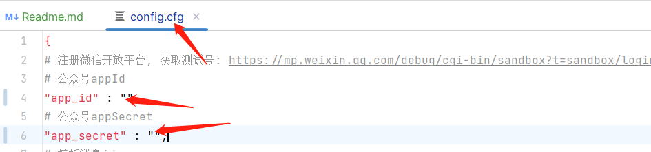
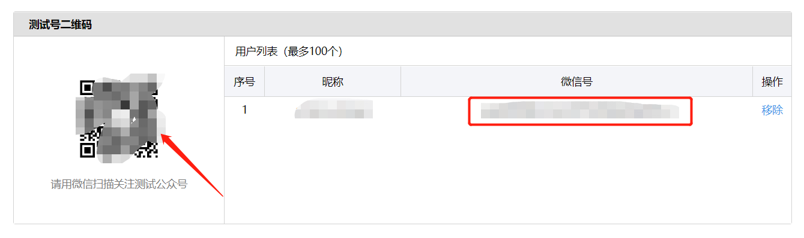
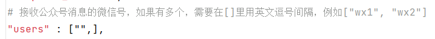
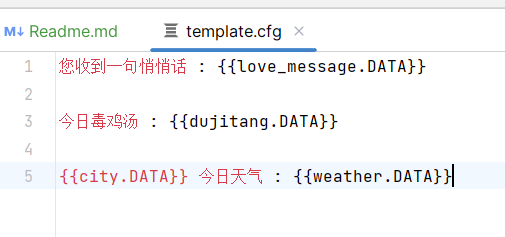
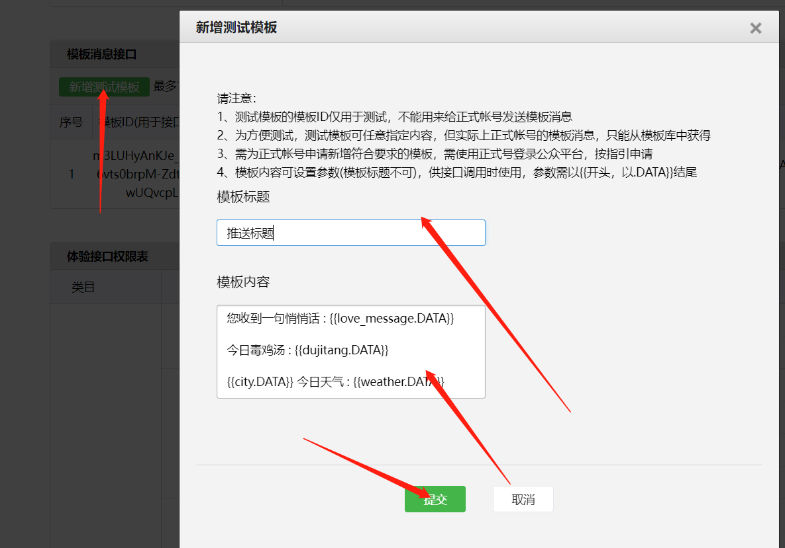
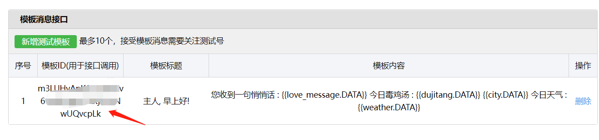

# 微信测试公众号推送

## 0. 按照依赖

```shell
pip3 install -r .\requirements.txt
```

## 1. 注册测试公众号

https://mp.weixin.qq.com/debug/cgi-bin/sandbox?t=sandbox/login

## 2. 复制appId和appSecret

### 如图



### 粘贴到config.cfg的对应位置



## 3. 添加测试用户

### 扫描微信公众平台的测试号二维码, 并复制微信号



### 添加到config.cfg中的users中, 多个用户则查看users上面的注释



## 4. 编辑发送模板template.cfg

新增的变量使用`{{变量.DATA}}`语法


### 复制模板到微信公众平台



### 复制模板id到config.cfg中的template_id

> 不要有空格
>


## 5. config.cfg其他API参数, 请自行注册获取

## 6. 修改 main.py

```
wechatPush = WeChatPush()
api = API(wechatPush.get_config())
################ 修改以下参数#############
# put_send_data(key, value)第一个参数必须与模板的变量名称对应, 第二个参数必须返回字符串
# 自己在API.py的类中设计函数
wechatPush.put_send_data("love_message", api.get_love_message())
wechatPush.put_send_data("dujitang", api.get_dujitang())
wechatPush.put_send_data("city", api.get_city())
wechatPush.put_send_data("weather", api.get_weather())
######################################
wechatPush.run()
```

## 7. 运行main.py

```
python3 main.py
```


